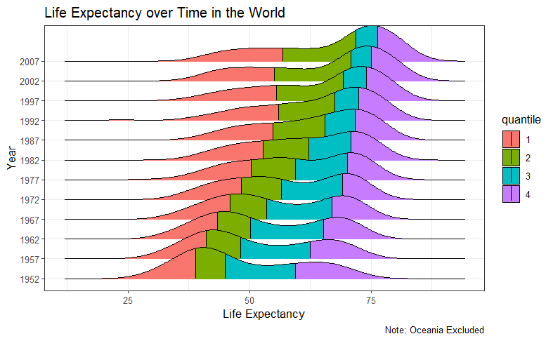
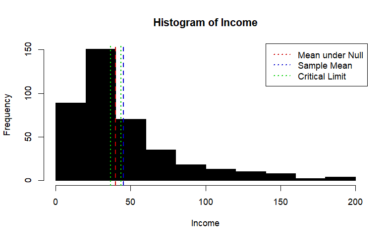
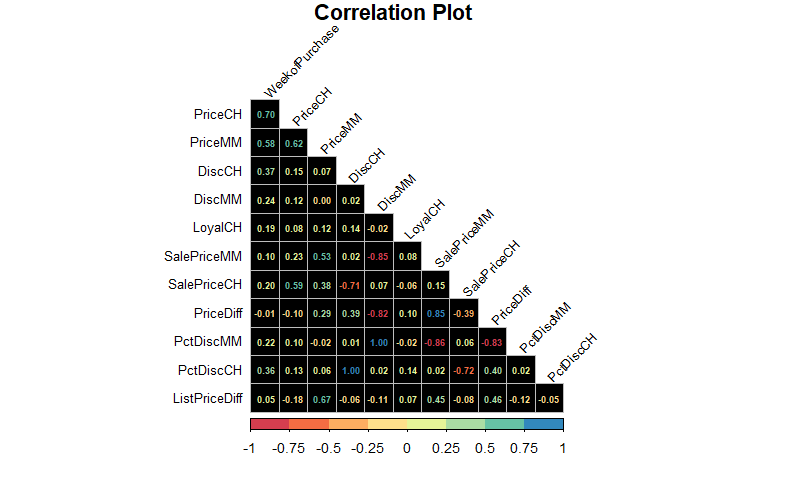
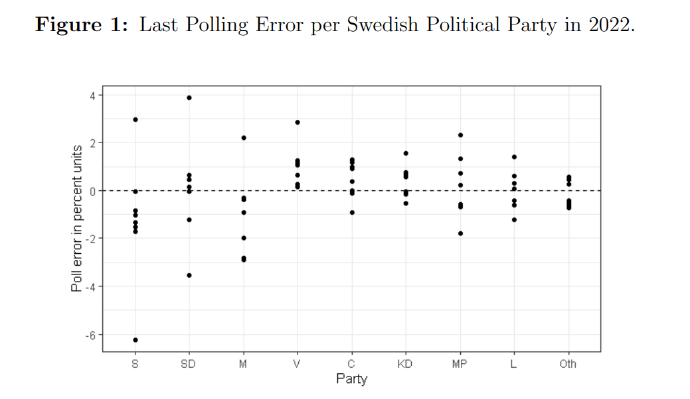

# About Me
- 📊 Statistician and Data Scientist
- 💻 R, Python, SQL, Tableau, Excel
- 🔭 Open to work in the Stockholm/ Uppsala area
- 🌱 Currently studying Advanced Econometrics
- 📫 How to reach me: www.linkedin.com/in/max-f-johansson

# My Public Portfolio
The following are some of my public projects in statistics. By clicking on the title of the project you will be redirected to it.

## [Data Visualization](https://muddaj.github.io/Data-Visualization/)
In this project I visualize some data on the world population between 1952 up to 2007. I visualize how life expectancy has evolved over time in the world as well as per continent. 

  

## [2 Hypothesis Tests](https://muddaj.github.io/Portfolio-Hypothesis-Testing/)

In this project I perform two hypothesis tests: First, I test if the mean income of the individuals is significantly different from 40.000 $, then I test if the mean income of unmarried individuals is significantly different from the mean income of married individuals.

  

## [Logistic Lasso Regression](https://muddaj.github.io/Logistic-Regression/)
In this project I predict which of 2 brands of juice customers purchase based on customer characteristics. I first use logistic regression, and then logistic Lasso penalized regression since there are high correlations among a number of predictors.

  

# Academic Reports

## [Bachelor's Thesis in Statistics](https://urn.kb.se/resolve?urn=urn:nbn:se:uu:diva-495793)
For our Bachelor's thesis in Statistics, my dear friend Michael and I investigated if Swedish polling industry suffered from bias in the 4 general elections between 2010 and 2022. We used the last poll per major polling house and political party as an estimate, then considered the number of underestimations or overestimations per party as a potential indication of polling industry bias. In the paper, we also performed a simulation.

  

