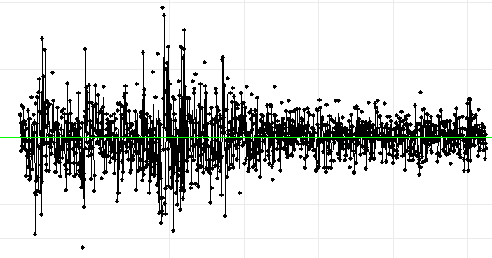

# About Me
- 📊 Statistician and Data Scientist
- 💻 R, Python, SQL, Tableau, Excel
- 🔭 Open to work in the Stockholm/ Uppsala area
- 🌱 Currently studying Advanced Econometrics
- 📫 How to reach me: www.linkedin.com/in/max-f-johansson

# My Public Portfolio
Welcome to my statistics and data science portfolio. Please click on the title of the project to be redirected:

## [Project 1: Linear and Logistic Regression - Financial Index Data](https://muddaj.github.io/Portfolio-case-1/)

## [Project 2: Logistic Regression vs. Logistic Lasso Regression - Juice Consumer Data](https://muddaj.github.io/Portfolio-case-2/)

## [Project 3: Linear Regression vs. Regression Tree](https://muddaj.github.io/Portfolio-case-3/)
In progress.

# Academic Reports

## [Bachelor's Thesis in Statistics](https://urn.kb.se/resolve?urn=urn:nbn:se:uu:diva-495793)
For our Bachelor's thesis in Statistics, my dear friend Michael and I investigated if Swedish polling industry suffered from bias in the 4 general elections between 2010 and 2022. We used the last poll per major polling house and political party as an estimate, then considered the number of underestimations or overestimations per party as a potential indication of polling industry bias. In the paper, we also performed a simulation.

