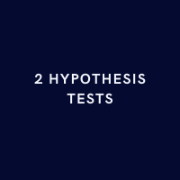
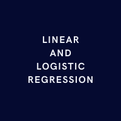
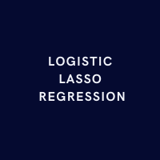
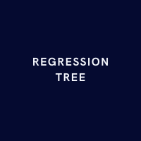

# About Me
- 📊 Statistician and Data Scientist
- 💻 R, Python, SQL, Tableau, Excel
- 🔭 Open to work in the Stockholm/ Uppsala area
- 🌱 Currently studying Advanced Econometrics
- 📫 How to reach me: www.linkedin.com/in/max-f-johansson

# My Public Portfolio
Here are some brief projects of mine where I apply various statistical and machine learning methods to data. By clicking on the title of the project you will be redirected to it.

## [2 Hypothesis Tests](https://muddaj.github.io/Portfolio-Hypothesis-Testing/)

In this project I perform two hypothesis tests: First, I test if the mean income of the individuals is significantly different from 40, then I test if the mean income of unmarried individuals is significantly different from the mean income of married individuals.

  

## [Linear and Logistic Regression](https://muddaj.github.io/Portfolio-case-1/)
In this project I predict the daily return and the direction a financial index between 2001 and 2005. I use daily returns of the prior days as well as the trading volume of the day as predictors. To predict the daily return I use linear regression and to predict the direction of the daily return I use logistic regression.  

  

## [Logistic Lasso Regression](https://muddaj.github.io/Portfolio-case-2/)
In this project I predict which of 2 brands of juice customers purchase based on customer characteristics. I first use logistic regression, and then logistic Lasso penalized regression since there are high correlations among a number of predictors.

  

## [Regression Tree](https://muddaj.github.io/Portfolio-case-3/)
In this project I predict the rating of a customer based on customer characteristics. I use a linear regression model as well a regression tree model. 

  

# Academic Reports

## [Bachelor's Thesis in Statistics](https://urn.kb.se/resolve?urn=urn:nbn:se:uu:diva-495793)
For our Bachelor's thesis in Statistics, my dear friend Michael and I investigated if Swedish polling industry suffered from bias in the 4 general elections between 2010 and 2022. We used the last poll per major polling house and political party as an estimate, then considered the number of underestimations or overestimations per party as a potential indication of polling industry bias. In the paper, we also performed a simulation.

  

