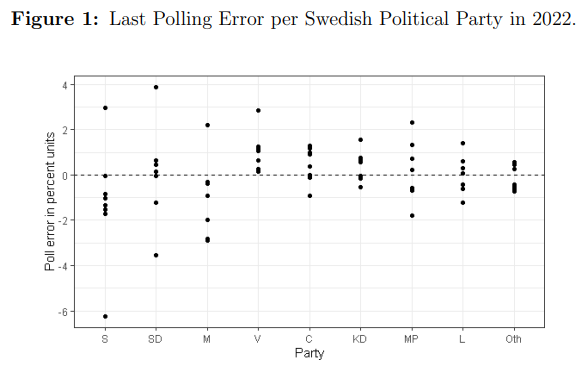

# About the Page

Welcome to my Github Portfolio Page!

While you will find some of my public showcase projects here, I want to highlight that I have chosen to keep most of my projects private. Should you require further insight into my capabilities, please feel free to reach out to me directly. I would be more than happy to provide additional information or arrange a private demonstration tailored to your requirements. 

# About Me
- 📊 Aspiring:      Statistician and Data Scientist / Analyst
- 💻 Software:      R, Python, SQL, Tableau, Excel
- 🔭 Open for:      work in the Stockholm/ Uppsala area
- 🌱 Currently:     studying to my Masters Degree in Statistics
- 📫 Contact me:    max.f.johansson@outlook.com
- 🌍 Linkedin:      www.linkedin.com/in/max-f-johansson

- 
# My Public Portfolio

## [Data Visualization](https://muddaj.github.io/Data-Visualization/)
In this project I visualize some data on the world population between 1952 up to 2007. I visualize how life expectancy has evolved over time in the world as well as per continent. 

  

## [2 Hypothesis Tests](https://muddaj.github.io/Portfolio-Hypothesis-Testing/)

In this project I perform two hypothesis tests: First, I test if the mean income of the individuals is significantly different from 40.000 $, then I test if the mean income of unmarried individuals is significantly different from the mean income of married individuals.

  

## [Logistic Lasso Regression](https://muddaj.github.io/Logistic-Regression/)
In this project I predict which of 2 brands of juice customers purchase based on customer characteristics. I first use logistic regression, and then logistic Lasso penalized regression since there are high correlations among a number of predictors.

  

# Academic Reports

## [Bachelor's Thesis in Statistics](https://urn.kb.se/resolve?urn=urn:nbn:se:uu:diva-495793)
For our Bachelor's thesis in Statistics, we investigate if the Swedish polling industry may have suffered from bias in the 4 general elections between 2010 and 2022. We used the last poll per major polling house and political party as an estimate, then considered the number of underestimations or overestimations per party as a potential indication of polling industry bias. In the paper, we also performed a simulation. The report is written in English. 

  

## [Bachelor's Thesis in Business Studies](https://urn.kb.se/resolve?urn=urn:nbn:se:uu:diva-468117)
For our Bachelor's thesis in Business Studies, we investigate the relationship between stock returns (outcome variable) and discretionary accruals, non-discretionary accruals and operating cash flows (predictors). The study is limited to stocks in the Nordics (Sweden, Norway, Denmark, Finland and Iceland) for the years 2015 to 2020, and is written in Swedish. 

